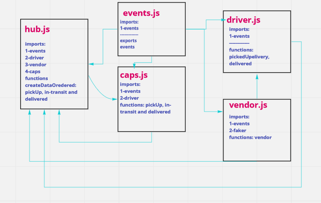

# caps

Is an application for a product called CAPS, and it simulate a delivery service where vendors (such a flower shops) will ship products using the delivery service and when the drivers deliver them, each vendor will be notified that their customers received what they purchased.

And this is an event driven application that “distributes” the responsibility for logging to separate modules, using only events to trigger logging based on activity.

[PR link](https://github.com/salammustafa728/caps/pull/1)

## UML-Caps

